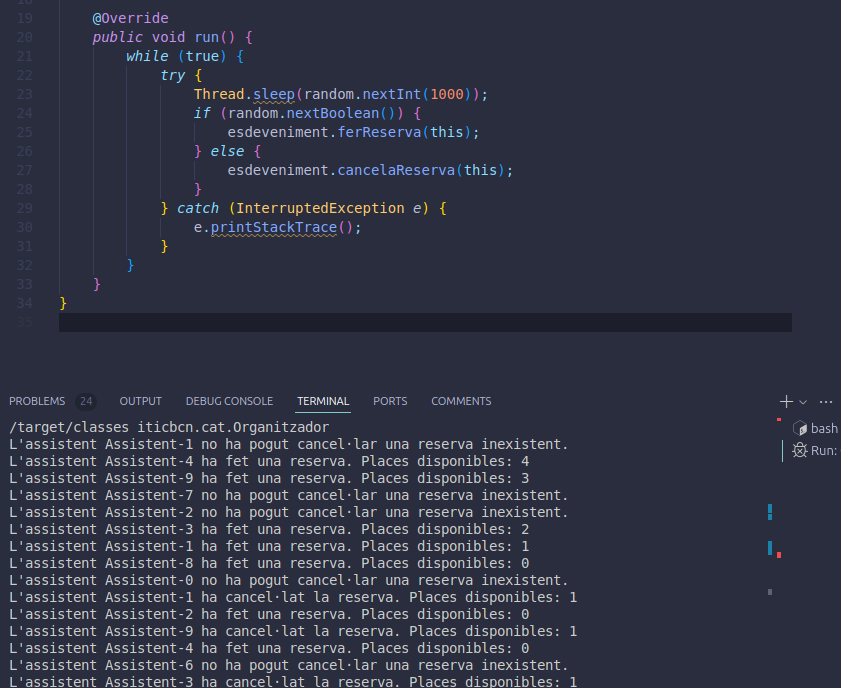
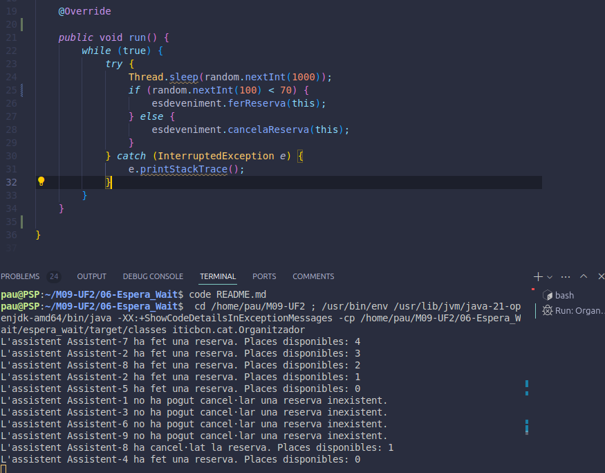

# Preguntes Teòriques

## 1. Per què s’atura l’execució al cap d’un temps?
S'atura perque en els entorns multithreading els fils es poden interrumpir per l'usuari.
A més si tots els usuari es estan esperant a que es lliuru una plaça peró ningu la cancela es genera un deadlock que fa que ningu pugui continuant executant-lo.

## 2. Què passaria si en lloc de una probabilitat de 50%-50% fora de 70%(ferReserva)-30%(cancel·lar)? I si foren al revés les probabilitats? → Mostra la porció de codi modificada i la sortida resultant en cada un dels 2 casos

### Cas normal:

### Cas amb 70 -30:

## 3. Per què creus que fa falta la llista i no valdria només amb una variable sencera de reserves?

És necesaria perque ha de mantenir el seguiment dels assistents que han fet una reserva de una plaça, si només fesim un int amb el numero de reserves no podriem gestionar les cancel.lacions ni saber qui ha fet cada reserva, creant inconsistències.
I permetria permetre a un assisten cancelar una reserva que no te.

